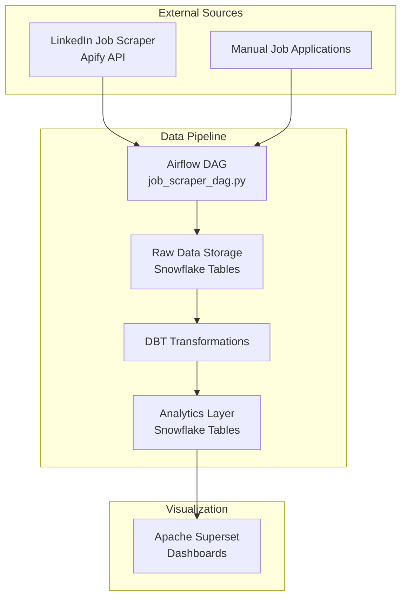
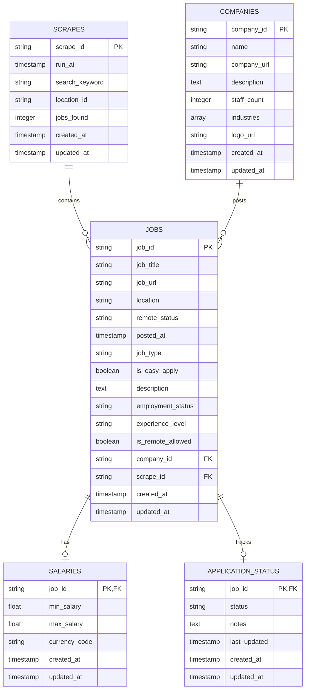
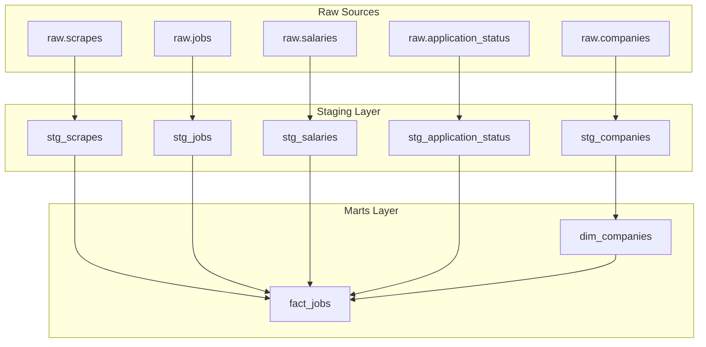
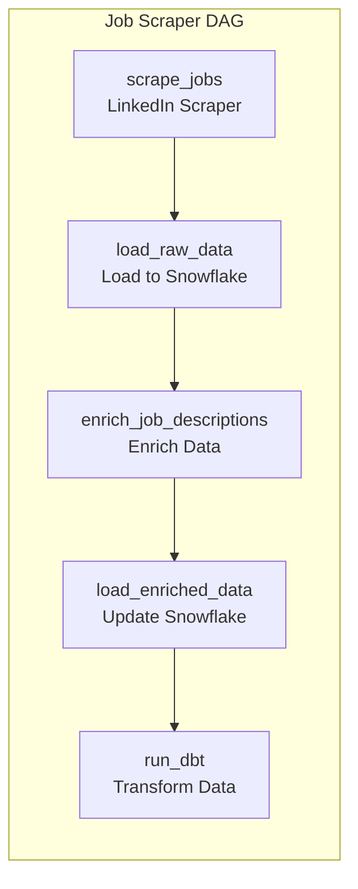
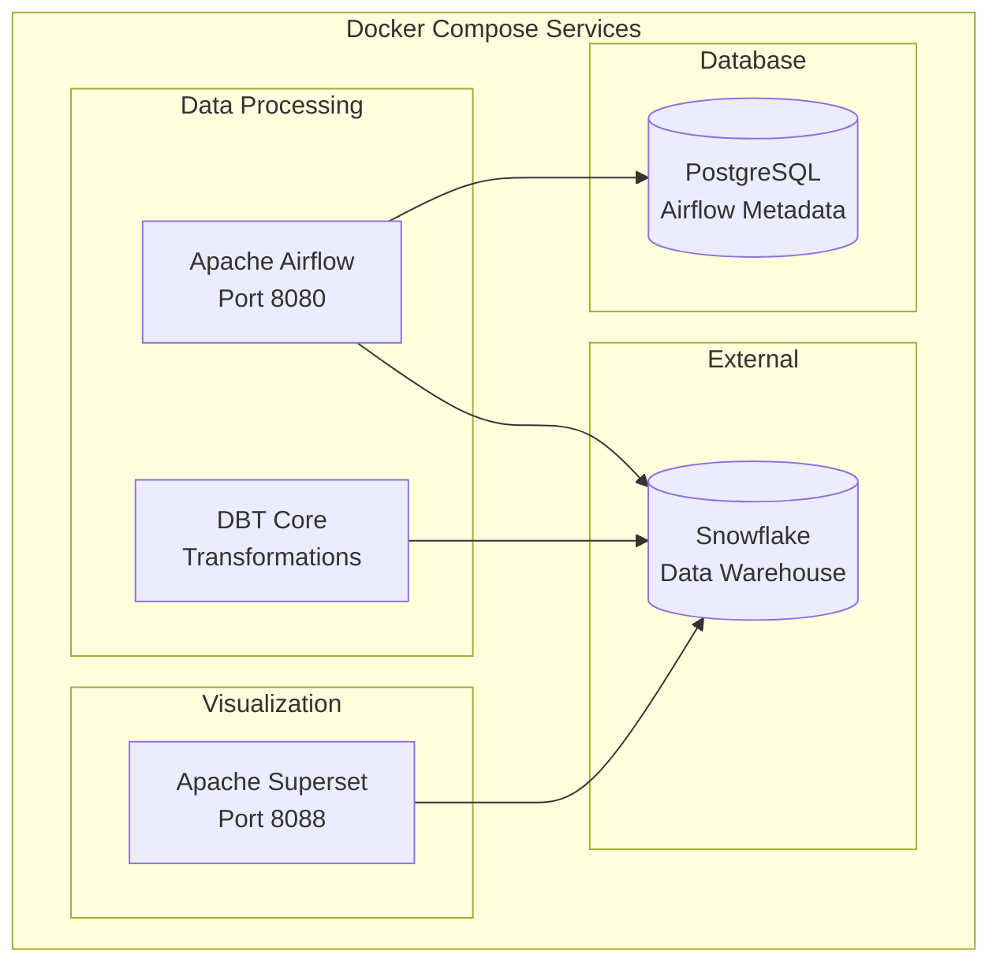
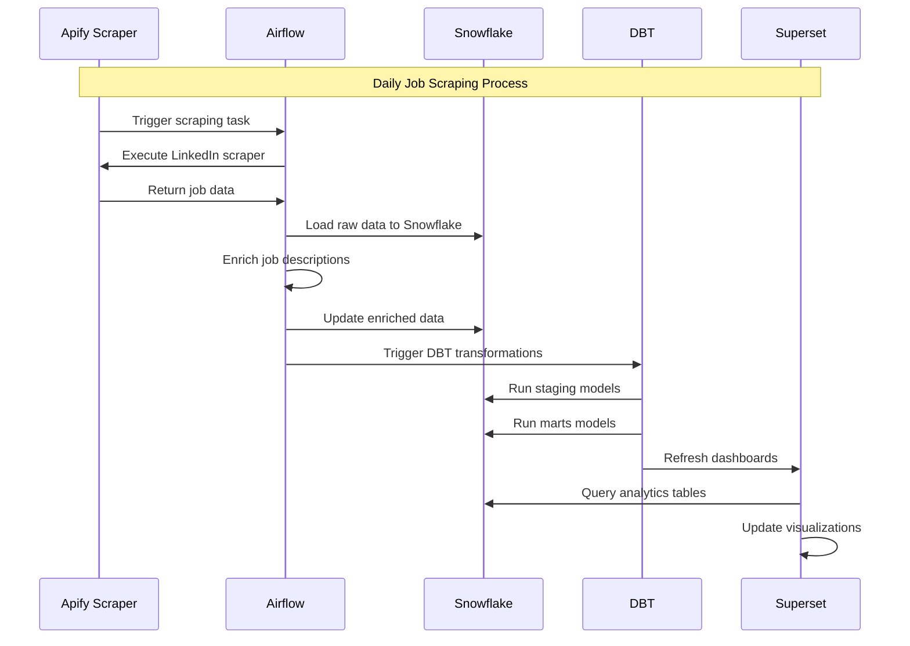
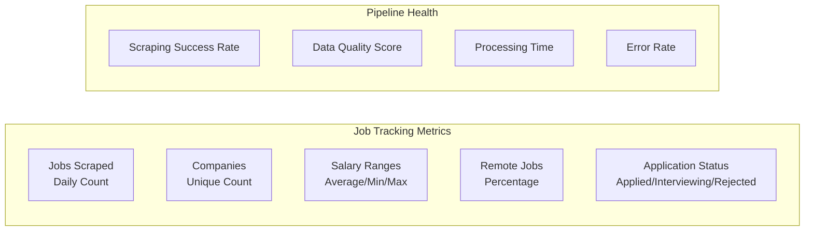
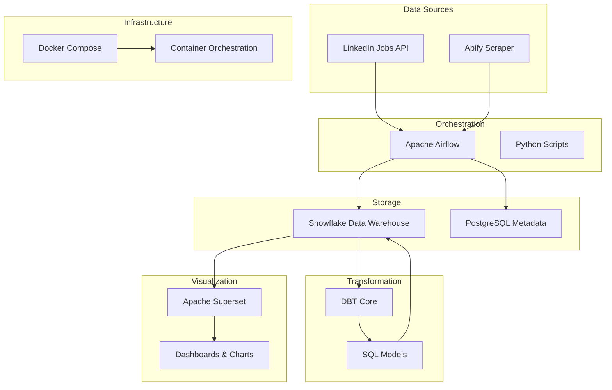

# 🔍 Job Tracker Pipeline

A fully containerized data engineering pipeline that scrapes LinkedIn job listings, loads them into Snowflake, transforms the data with DBT, and visualizes job insights in Apache Superset.

## 📦 Tech Stack

- **Airflow (Docker)** – orchestrates scraping, ingestion, and transformations
- **Apify** – scrapes LinkedIn job data via public actors
- **Snowflake** – cloud data warehouse for storing raw + enriched job data
- **DBT** – transforms and deduplicates job data
- **Superset** – dashboards for visualizing job matches and application progress

## ✍🏻 Pipeline Architecture

### 🏗️ Overall Architecture

### 📊 Database Schema & Table Relationships

### 🔄 DBT Model Dependencies

### 🚀 Airflow DAG Flow

### 🐳 Docker Services Architecture

### 📈 Data Flow Timeline

### 🎯 Key Metrics & KPIs

### 🔧 Technology Stack

